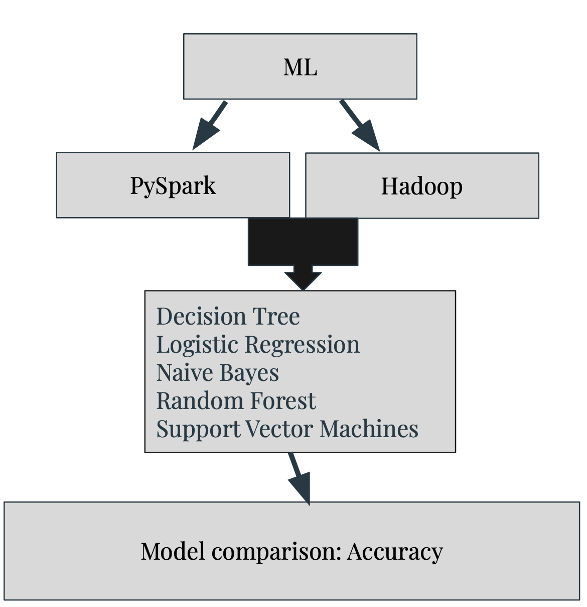
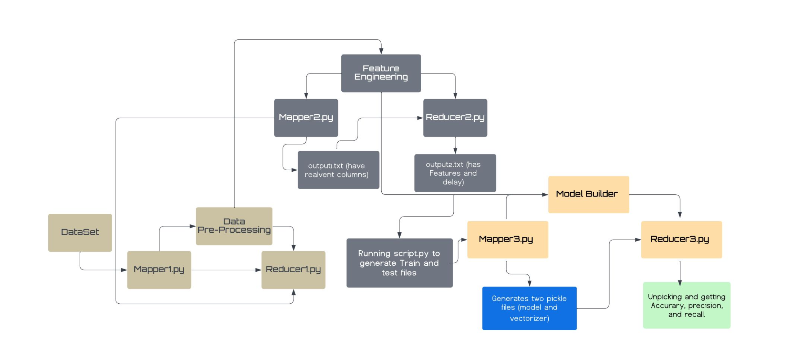
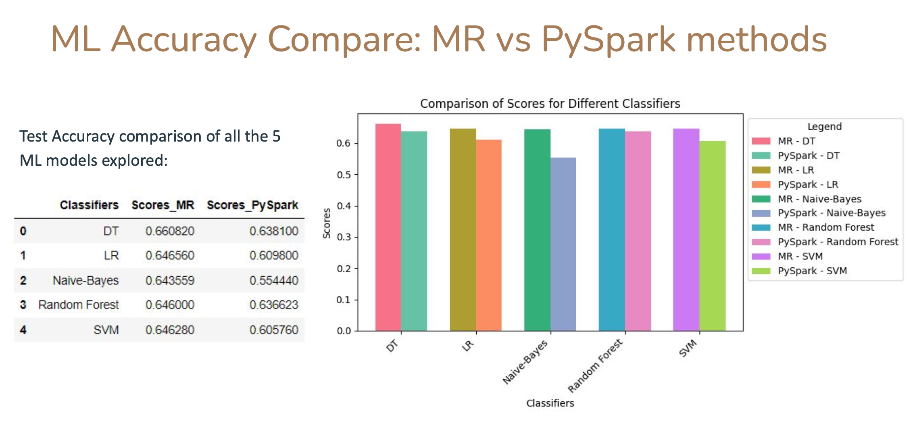

# **Predicting Flight Delays with PySpark: A Machine Learning Approach**

*Rutgers ECE 494/579 - Cloud Computing & Big Data (Fall 2023)*

*By: Mohit Agarwal & Arslan Tariq*

## Introduction
Flight delays pose significant challenges for both travelers and airlines. This project addresses this issue by leveraging cloud computing methodologies, particularly through Apache Spark and its   PySpark library, for large-scale data processing. By harnessing the power of distributed computing and cloud-based infrastructure, we aim to efficiently analyze vast amounts of flight data. Our         approach integrates machine learning techniques alongside cloud computing paradigms, employing algorithms like Decision Trees, Random Forests, Logistic Regression, and Naive Bayes for predictive        modeling. Through the parallel processing capabilities of Spark, we utilize map and reduce operations to optimize data processing tasks. This project represents a fusion of cloud computing and          machine learning, aiming to enhance predictive accuracy while efficiently handling the complexities of flight data analysis at scale

## Problem Statement

Imagine a world where you can avoid airport chaos and plan your travel seamlessly!  This project aims to build a model using open-source flight data that can predict flight delays with high accuracy. Leveraging scalable cloud-based Machine Learning and Data Science models, this project aims to accurately predict flight delays using datasets from open-source platforms like Kaggle.

## Approach

 

We will leverage PySpark and Hadoop for processing large datasets. Our analysis will involve employing a variety basic classification based machine learning algorithms including Decision Tree, Logistic Regression, Naive Bayes, Random Forest, and Support Vector Machines.

## Workflow

### Data Preprocessing (Mapper1 & Reducer1):
Cleans data by removing spaces, null values, and converting miles to km.

### Feature Selection (Mapper2 & Reducer2):
Selects relevant columns and converts them to appropriate data types.
Creates a feature assembler dataframe with separate "features" and "labels" columns.

### Training and Testing Model Building (Mapper3 & Reducer3):
Splits the feature assembler dataframe into training and testing datasets.
Trains a model using MapReduce tasks.
Generates a pickle file for the trained model and vectorizers.
Evaluates model performance on the testing data using the trained model.

## Method 1: PySpark

### Data Pre-processing

1. Import the CSV file and create a SparkSession to store the file contents into a Data Frame.
2. Display the data frame and delete records with missing values.
3. Create binary labels to indicate flight delays:
   - 0 = Not delayed (Negative value in Data Frame)
   - 1 = Delayed (Positive value in Data Frame)
4. Assign numerical values to categorical data (carrier and organization) for inclusion in training. Categorical data is converted to quantitative data.

### Feature Engineering:

- Feature selection step: Use an assembler object to consolidate predictor columns (features) after implementing One-Hot Encoding (OHE) on categorical data.
- Columns included: ['mon', 'dom', 'dow', 'carrier_idx', 'org_idx', 'km', 'depart', 'duration']
- Output column: 'features'
- Predicted label column: 'delay' (converted into binary column)

### Train/Test Split:

- Machine Learning consists of two processes: Model Training and Model Testing.
- Testing Data Selection involves ensuring:
  - Data is large enough for meaningful statistical results.
  - Test data has similar characteristics to training data.
- Ideal partition: 80:20 ratio.
- 80% of the dataset is used for training, 20% for testing.
- Method used: `DataFrame.randomSplit()`.
- Inputs: Seed and Weights.

## Method 2: Hadoop

## Observation

## Results and Discussion

* Trained model are saved as pickle files. 
* Feature selection is key to model outcomes. 
* Metrics for comparison : Accuracy, Recall and Precision. 
* Decision Tree emerged as best ML model
  

## Conclusion
* Successfully build a machine learning pipeline to predict flight delay using a publicly  available dataset.
* Map-Reduce (MAPPER.py and REDUCER.py) code scripts developed to execute data-preprocessing, feature selection and model builder in PySpark and local Map-Reduce test done on HADOOP implementation.
* Map-Reduce framework implementation produced marginally better performance compared to PySpark
* Hadoop implementation on local HDFS is challenging due to need of setting up env. variables and installing ML libraries. 

